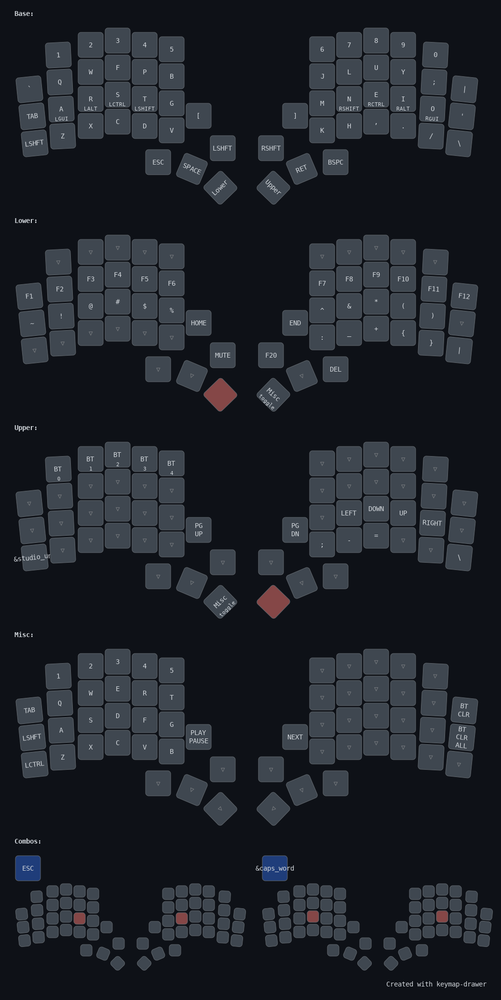

# Krypton-KBD

Ergonmic split keyboard created with [ergogen](https://github.com/ergogen/ergogen).

Named after the noble gas [krypton](https://en.wikipedia.org/wiki/Krypton).

## Features
* Completely wireless with support for wired
* One rotary encoder per half
* Num row
* Ergonomic, easily reachable thump cluster, also ideal for larger hands
* 3D-printed case and switchplate
* Support for [ZMK Studio](https://zmk.dev/docs/features/studio), allowing keymap changes without reflashing
* Support for nice!view displays

## Images

# Build instructions
The build instructions can be found [here](https://github.com/mroetsc/krypton-kbd/blob/main/docs/build_instructions.md).

## Keymap
The default keymap is for Colemak-DH. It can easily be changed using [ZMK Studio](https://zmk.dev/docs/features/studio).

